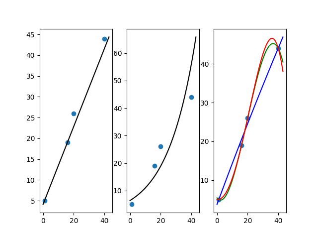
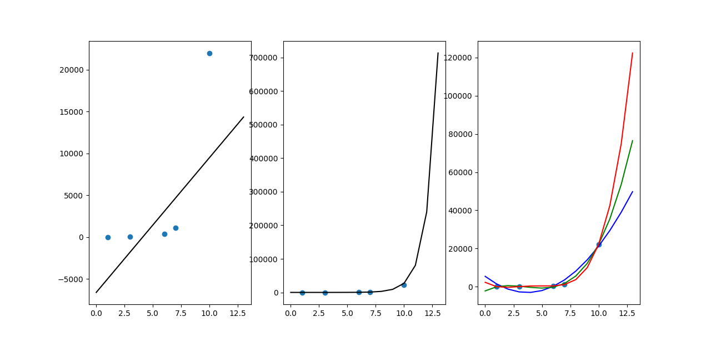
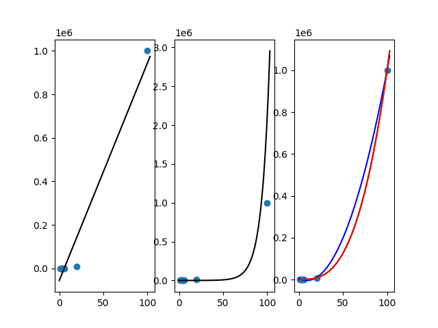
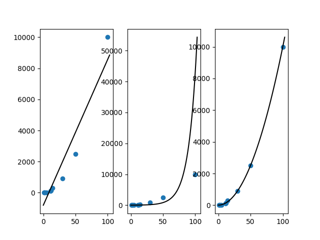
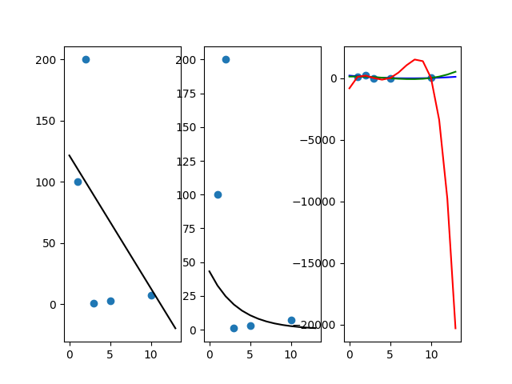

Вот что будет, если данные будут +- линейными:
(1, 5)
(16, 19)
(20, 26)
(40, 44)

***
Вот что будет, если данные будут экспоненциальными:
(1,1)
(10,22000)
(6,400)
(3,20)
(7,1100)

***
И еще несколько картинок
Кубические: 

Квадратичные:

Случайные: 

